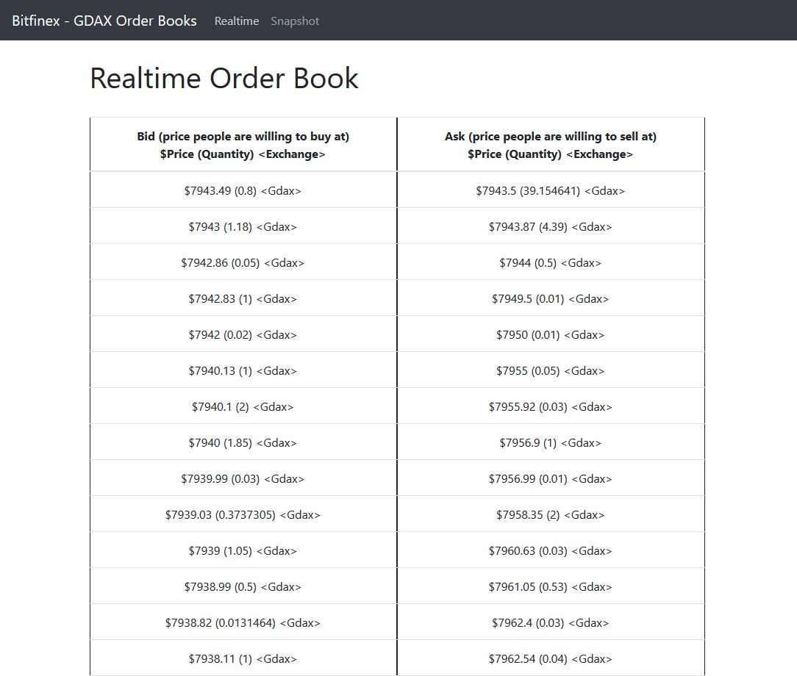
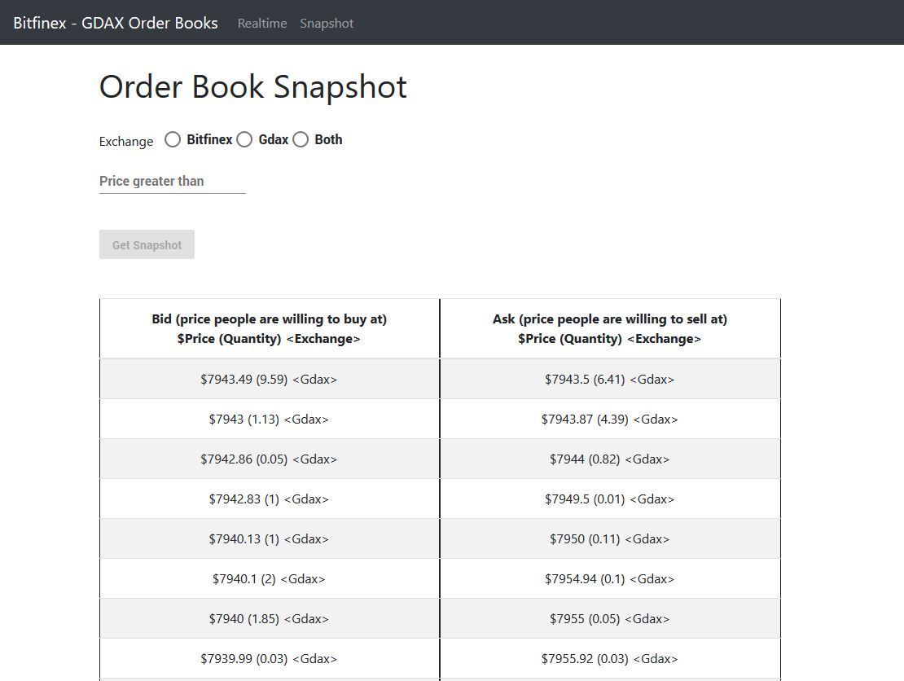

# Real-time Websocket Client

This Angular application connects to the backend websocket and receives the order books and updates emitted, displaying them in real-time. A REST endpoint is also implemented which only retrieves the snapshot.

## Setup

Download or clone the repository

`> npm install`

`> ng serve --open`

